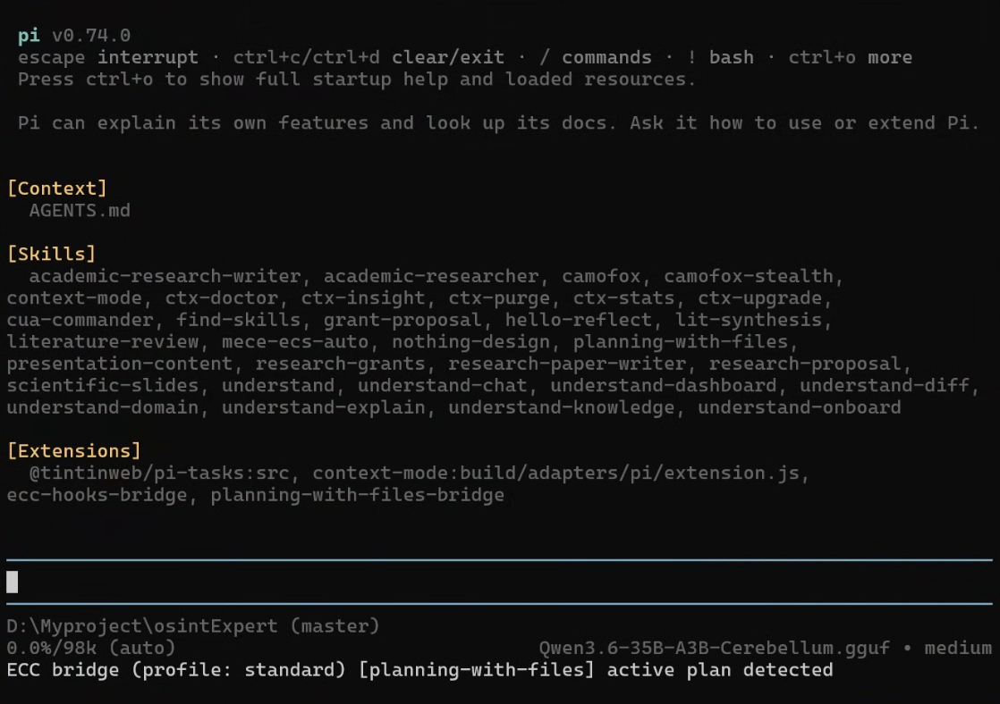

# 🚀 CK's Pi Code Agent Harness (Flagship v3.8)



> **一鍵重建工業級 AI 開發環境** —— 為你的 Pi 助手注入全球頂尖專家的開發直覺與嚴謹紀律。

`CK's Pi Code Agent Harness` 是一個專為 [Pi Coding Agent](https://github.com/badlogic/pi-mono) 打造的**旗艦級配置增強套件**。本專案不僅是配置的集結，更是一套深度的**智慧蒸餾系統**。它透過「原生映射 (Native Mapping)」技術，整合了 GitHub 15+ 個頂尖開源倉庫，讓您的 Pi 助手具備從產品決策、架構設計到自我進化的全生命週期專家能力。

---

## 🧪 早期體驗：下一代「全能裝束」 (Universal v4.0+)

**「如果您想在 Claude Code 或 Gemini CLI 之間切換，或是在新電腦上重新安裝，選這個就對了！」**

我們正在開發 v4.0 版本，讓您的開發環境具備「跨平台自動適配」與「環境自癒」能力。

### 1. 複製並執行（只需 30 秒）
```bash
# 取得具備自癒能力的開發版
git clone -b feat/universal-harness --recursive https://github.com/Chiakai-Chang/CKs_PI_Code_Agent_Harness.git
cd CKs_PI_Code_Agent_Harness

# Windows: 雙擊 install.bat (建議按右鍵管理員執行)
# macOS / Linux: bash install.sh
```

### 2. 它會幫您做什麼？
*   **🧹 環境自動大掃除**：偵測到舊的、混亂的 Extension？它會自動備份並為您建立最純淨的環境。
*   **✨ 智慧遺產繼承**：您的 API Keys 與模型配置會被自動找回來並還原，**不需要重新設定**。
*   **🤖 一次安裝，全家適用**：不論您目前啟動的是 `claude` 還是 `pi`，專家神力都會自動投影到對應的工具。

### 3. 開始開發 (必試指令)
安裝完成後，直接啟動您的 AI CLI (輸入 `pi` 或 `claude`)，體驗以下神力：
*   **/omg:team**：召喚一支由架構師與執行者組成的專家團隊作戰。
*   **/aibdd-kickoff**：啟動嚴謹的行為驅動開發 (BDD) 流程。
*   **/pip:status**：當 AI 卡關時，強制啟動「極限求生」模式解決問題。
*   **/pm:north-star**：校準產品價值，拒絕無效開發。

---

## 🏗️ 九大技術支柱 (The 9 Pillars)

基於 [**核心設計理念 (CORE_CONCEPTS.md)**](docs/core/CORE_CONCEPTS.md) 與 [**v3.7 蒸餾導則**](docs/core/DISTILLATION_GUIDE.md)，我們為 Pi 構建了完整的開發大腦：

1.  **🛡️ 紀律守護 (ECC Hooks)**：整合 70+ 專業代理人與自動化掛鉤，在 AI 闖禍前（如語法錯誤、金鑰洩漏）秒級攔截。
2.  **🧠 專家直覺 (Superpowers)**：注入工業級工程紀律，強制 AI 實施 TDD 與系統化規劃。
3.  **🔍 代碼 GPS (Understand)**：利用知識圖譜技術，讓 AI 具備解讀數萬行複雜專案的「上帝視角」。
4.  **📚 專案大腦 (LLM Wiki)**：實作 Karpathy 模式，讓專案知識隨時間複利成長，建立持久的維基索引。
5.  **📝 戰術持久 (Manus Planning)**：實體化任務計畫，確保斷點續傳，徹底解決長對話導致的 AI 「失憶」問題。
6.  **🏭 代理工廠 (OMC Teams)**：建立多代理編排流水線，召喚架構師、執行者與審查員協同作戰。
7.  **🧪 誠信工廠 (AIxBDD)**：實施嚴格的行為驅動開發 (BDD)，確保代碼與規格 100% 對齊。
8.  **🧬 自我進化 (Evolver Engine)**：基於 GEP 協定，將成功修復固化為「基因」，實現跨會話的能力遺傳。
9.  **🧭 產品決策 (PM Skills)**：內建 100+ 頂尖 PM 框架，從北極星指標到 PRD 審計，拒絕無效開發。

> ℹ️ 每一項整合的技術細節與決策背景，請參閱 [**🗺️ 戰略索引地圖 (STRATEGIC_MAP.md)**](docs/strategy/STRATEGIC_MAP.md)。

---

## 📂 整合生態系 (Integrated Masterpieces)

本專案透過 Git Submodule 連結以下大師級資產，確保與上游 100% 同步：

| 領域 | 來源專案 / 大師 | 賦予 Pi 的核心神力 |
| :--- | :--- | :--- |
| **工程紀律** | [ECC](https://github.com/affaan-m/everything-claude-code) | 自動品質門檻、安全審查、50+ 特種代理人。 |
| **方法論** | [Superpowers](https://github.com/obra/superpowers) | TDD 驅動、系統化規劃、專家選擇直覺。 |
| **行為準則** | [Karpathy](https://github.com/forrestchang/andrej-karpathy-skills) | 鎖定 Andrej Karpathy 觀察的 LLM 避坑開發指南。 |
| **認知提取** | [Nuwa (女媧)](https://github.com/alchaincyf/nuwa-skill) | **專家工廠**：內建 15 位名家（賈伯斯、芒格等）思維框架。 |
| **TS 專家** | [Matt Pocock](https://github.com/mattpocock/skills) | 宏觀架構導航、深模組化重構、TypeScript 深度偵錯。 |
| **Web 權威** | [Addy Osmani](https://github.com/addyosmani/agent-skills) | Google 級效能審計、API 契約設計、懷疑驅動開發 (DDD)。 |
| **提示工程** | [Prompt Master](https://github.com/nidhinjs/prompt-master) | 提示詞自動壓縮與跨模型指令翻譯，極致節省 Token。 |
| **CLI 標準** | [Printing Press](https://github.com/mvanhorn/cli-printing-press) | 實施 **CK-Spec-01** 標準，打造 Agent-Native 精簡輸出。 |
| **BDD 專家** | [AIxBDD](https://github.com/Waterball-Software-Academy/aixbdd) | **誠信工廠**：RED-GREEN-REFACTOR 閉環、需求變更自動調和。 |
| **能動性守護** | [PIP Guardian](https://github.com/tanweai/pua) | **生產力改進**：4 級壓力升級、14 種大廠方法論、拒絕偷懶。 |
| **代理工廠** | [OMC](https://github.com/Yeachan-Heo/oh-my-claudecode) | **多代理編排**：32+ 專業角色、Sisyphus 持久化、團隊模式。 |
| **安全治理** | [YES.md](https://github.com/sstklen/yes.md) | **六層防禦**：Anti-Slack 偵測、機器強制 Hooks、安全閘門。 |
| **視覺美學** | [Taste Engine](https://github.com/Leonxlnx/taste-skill) | **視覺指揮官**：三旋鈕參數控制、反 AI 罐頭化、極致性能。 |
| **產品決策** | [PM Skills](https://github.com/phuryn/pm-skills) | **戰略圖書館**：100+ 頂尖 PM 框架、北極星指標、需求審計。 |
| **自我進化** | [Evolver](https://github.com/EvoMap/evolver) | **基因優化**：掃描失敗模式、固化抗體基因、實現長期成長。 |

---

## 🚀 快速上手 (Quick Start)

### 1. 取得專案
```bash
git clone --recursive https://github.com/Chiakai-Chang/CKs_PI_Code_Agent_Harness.git
cd CKs_PI_Code_Agent_Harness
```

### 2. 一鍵部署
*   **Windows**: 雙擊 `install.bat` (建議管理員執行)。
*   **macOS / Linux**: `bash install.sh`。

> 系統會自動執行 **Map-Driven Restore**，將所有專家路徑與 80+ 位代理人注入您的環境。

### 3. 開始開發
```bash
pi
```

---

## 🛠️ 核心規格與自豪功能

*   **⚡ Map-Driven Restore**：完全捨棄散裝複製，改用智慧映射，支援全域絕對路徑定位。
*   **🧠 Context Kernel**：內建「上下文內核協議」，自動管理注意力預算，長對話中 Token 經濟提升 40%。
*   **🧠 Hippocampus (海馬迴)**：整合 `hello-reflect`，自動從您的修正中學習並更新 `CLAUDE.md`。
*   **🕵️ Stealth Force**：選配整合 `camofox-stealth`，具備繞過 Cloudflare 偵測的頂級隱身瀏覽力。
*   **📑 Rationale Archive**：每一項整合都有專屬的 `RATIONALE.md`，決策背景透明、戰略脈絡可追溯。

---

## ✅ 隱私、安全與信任

*   **本地優先**：針對 Ollama / llama.cpp 優化，代碼與智慧資產不出門。
*   **安全攔截**：內建 ECC 防火牆，防止 AI 意外刪除 `.env` 或推送金鑰。
*   **完全開源**：從腳本到 Prompts，一切透明。

---

## 🙏 感謝與授權

*   本專案採用 **MIT 授權**。
*   向所有在「整合清單」中出現的開源大師致敬，你們的智慧是本專案的靈魂。

---
**由 [CK (Chiakai Chang)](https://github.com/Chiakai-Chang) 維護，旨在打造最強適應力的 AI 開發環境。**

